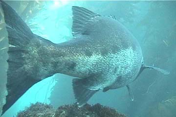

Identifying Tumor Growth Drivers in Biomedical Text
========================================================
author: Nathan Byers
date: October 26, 2017
autosize: true

Bass Ackwards
========================================================

***
- Found data and project first
- Then looked for paper on the subject

Motivation   
========================================================

</img>

- Personalized medicine Kaggle competition
- "Classifying Clinically Actionable Genetic Mutations"
- https://www.kaggle.com/c/msk-redefining-cancer-treatment

Problem
========================================================

- A sequenced tumor could have thousands of mutations
- Which mutations drive tumor growth and which don't

http://www.pancreaticcancer.net.au/research-genomics/ 

Problem
=========================================================

- Currently a manual process of searching text in biomedical
literature to classify mutations
- This is a bottleneck
- Can it be automated?

Challenge
========================================================

- Come up with an algorithm that will automate
this process
- A training data set of articles where the tumors have been manually
classified is provided on the Kaggle website
- A test data set is provided to score your algorithm
- My project will be to develop an algorithm that will classify
the mutations in the Kaggle training data and evaluate the performance
on the test data

Paper
========================================================

- Singhal A, Simmons M, and Lu Z. "Text mining for precision medicine: automating
disease-mutation relationship extraction from biomedical literature." _Journal of the
American Medical Informatics Association_ (2016) 23: 766-772.

- Objective
 - Identify disease-mutation relationships from biomedical texts
 - Develop a machine learning algorithm to automate the process
 - Focused on breast and prostate cancers because
 
 
Materials
======================================================

- Manually annotated text for breast and prostate cancer
from Doughty _et al._ for training the model

- Test set built from PubMed

- tmVar tool used to identify mutations in the text (Wei _et al._)

- DNorm tool used to identify the disease names in the text (Leaman _et al._)

- Weka for prediction

======================================================

=====================================================

 

Feature Construction
=====================================================

- Nearness to target disease score
- Target disease frequency score
- Other disease frequency score
- Same sentence disease-mutation co-occurrence score
- Within text sentiment score
- Text sentiment subjectivity score 

ML Algorithm
=====================================================

- Tested decision tree, multilayer perceptron, and Bayesian logistic regression
- Only reported decision tree results because of its superior performance

Results: Prostate Cancer
=====================================================

|        	|EMU	  |  tmVar|	EMU+NDM|tmVar+ML|
|---------|-------|-------|--------|--------|
|Precision|	0.729	|  0.720|	0.845	 |  0.904 |
|Recall	  |0.803	|  0.903|	0.681	 | 0.856  |
|F-measure|	0.764	|  0.801|	0.754	 |0.880   |

Results: Breast Cancer
==================================================

|         | EMU	 |tmVar |EMU+NDM |tmVar+ML|
|---------|------|------|--------|--------|
|Precision|0.806 |0.757 |0.924   |0.878   |
|Recall   |0.852 |0.923 |0.600   |0.813   |
|F-measure|0.828 |0.832	|0.730   |0.845   |

References
=====================================================

- Doughty E, Kertesz-Farkas A, Bodenreider O, et al. "Toward an automatic method for extracting cancer- and other disease-related point mutations from the biomedical literature." _Bioinformatics_. 2011 27(3):408–415

- Singhal A, Simmons M, and Lu Z. "Text mining for precision medicine: automating
disease-mutation relationship extraction from biomedical literature." _Journal of
the American Medical Informatics Association_ 2016 23: 766-772

- Leaman R, Doğan RI, Lu Z. "DNorm: disease name normalization with pairwise learning to rank." _Bioinformatics_ 2013 29(22):2909–2917

- Wei C-H, Harris BR, Kao H-Y, Lu Z. "tmVar: a text mining approach for extracting sequence variants in biomedical literature." _Bioinformatics_ 2013 29(11):1433–1439
