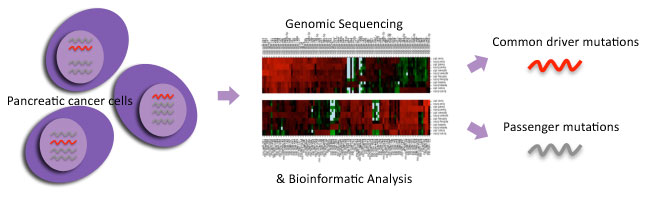
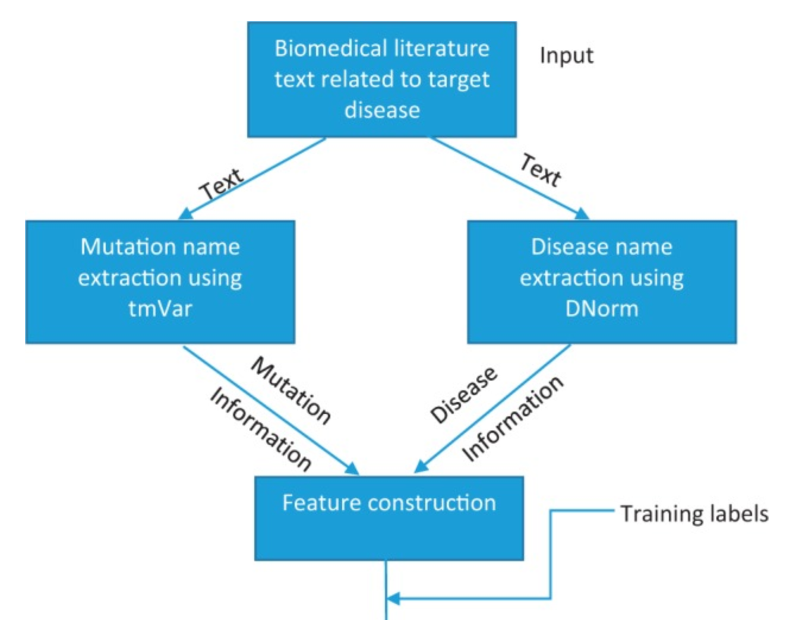
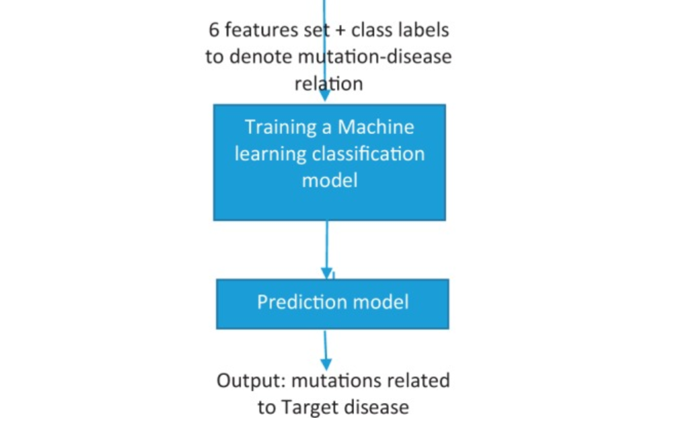

# Motivation   

- Did things backwards: picked my project first, then looked for paper...
- Personalized medicine Kaggle competition
- "Classifying Clinically Actionable Genetic Mutations"
- https://www.kaggle.com/c/msk-redefining-cancer-treatment

# Problem

- A sequenced tumor could have thousands of mutations
- Which mutations drive tumor growth and which don't

http://www.pancreaticcancer.net.au/research-genomics/ 

# Problem

- How is this currently handled in a precision medicine context?
- Manual process of searching text in biomedical
literature to classify mutations
- This is a bottleneck
- Can it be automated?

# Kaggle Challenge

- Come up with an algorithm that will automate
this process
- A training data set of articles where the tumors have been manually
classified is provided on the Kaggle website
- A test data set is provided to score your algorithm
- My project will be to develop an algorithm that will classify
the mutations in the Kaggle training data and evaluate the performance
on the test data

# Paper

- Singhal A, Simmons M, and Lu Z. "Text mining for precision medicine: automating
disease-mutation relationship extraction from biomedical literature." _Journal of the
American Medical Informatics Association_ (2016) 23: 766-772.

- Objective
 - Identify disease-mutation relationships from biomedical texts
 - Develop a machine learning algorithm to automate the process
 - Focused on breast and prostate cancers
 
 
# Materials

- Manually annotated text for breast and prostate cancers
from Doughty _et al._ for training the model

- Test set built from PubMed

- tmVar tool used to identify mutations in the text (Wei _et al._)

- DNorm tool used to identify the disease names in the text (Leaman _et al._)

- Weka for prediction

----------------------------------------------------

-------------------------------------------------

 

# Feature Construction

- Target disease frequency score (TDFS)
 - "This score is computed as the frequency count for the target disease mentioned 
 in the input text. This feature adds information about the dominance of target
 disease mentions in the text."
- Nearness to target disease score (NTDS)
 - "For a mutation identified in the text, its NTDS is an integer denoting a 
 cumulative score of all the times this mutation has the target disease as the 
 closest disease mentioned in the text."

 
# Feature Creation

- Other disease frequency score (ODFS)
 - "Unlike the TDFS, which captures information about the target disease in the 
 text, the ODFS denotes the frequency of the next most frequent disease mention 
 in the text other than the target disease. "
- Same sentence disease-mutation co-occurrence score (DMCS)
 - "For a mutation name and its nearest disease mentioned in the text, the DMCS
 is a binary score denoting the co-occurrence of the mutation and its nearest 
 disease in the same sentence."
 
# Feature Creation

- Within text sentiment score
 - "For a mutation name in the text and its corresponding nearest disease mentioned
 in the text, we extracted the 'within text,' which refers to the text between
 the mutation and the nearest disease mentioned. This text is then analyzed for 
 its sentiment..." 
- Text sentiment subjectivity score (TSSS)
 - "The TSSS corresponds to the subjectivity of the sentiment score computed in
 the previous feature. It provides an estimate of the reliability of the sentiment
 score."

# ML Algorithm

- Tested decision tree, multilayer perceptron, and Bayesian logistic regression
- Only reported decision tree results because of its superior performance

# Results: Prostate Cancer

|        	|EMU*	  |tmVar+ML|
|---------|-------|--------|
|Precision|	0.729	|  0.904 |
|Recall	  |0.803	| 0.856  |
|F-measure|	0.764	|0.880   |

* Current state of the art mutation extraction for given disease 
(Doughty _et al._)

# Results: Breast Cancer

|         | EMU	 |tmVar+ML|
|---------|------|--------|
|Precision|0.806 |0.878   |
|Recall   |0.852 |0.813   |
|F-measure|0.828 |0.845   |

# My Project

- Identify diseases (DNorm) and mutations (tmVar) in the Kaggle training text using
the National Center for Biotechnology Information API
 - https://www.ncbi.nlm.nih.gov/research/bionlp/APIs/ 
- Create features
 - Frequency of mutation
 - Distance from mutation to disease name
 - Distance from other mutations
 - Sentiment of text

# My Project

- Apply several machine learning algorithms
 - Decision Tree
 - Neural Network
 - Support Vector Machine
- Score on the test text and see which is most accurate

# References

- Doughty E, Kertesz-Farkas A, Bodenreider O, et al. "Toward an automatic method for extracting cancer- and other disease-related point mutations from the biomedical literature." _Bioinformatics_. 2011 27(3):408–415

- Singhal A, Simmons M, and Lu Z. "Text mining for precision medicine: automating
disease-mutation relationship extraction from biomedical literature." _Journal of
the American Medical Informatics Association_ 2016 23: 766-772

- Leaman R, Doğan RI, Lu Z. "DNorm: disease name normalization with pairwise learning to rank." _Bioinformatics_ 2013 29(22):2909–2917

- Wei C-H, Harris BR, Kao H-Y, Lu Z. "tmVar: a text mining approach for extracting sequence variants in biomedical literature." _Bioinformatics_ 2013 29(11):1433–1439

